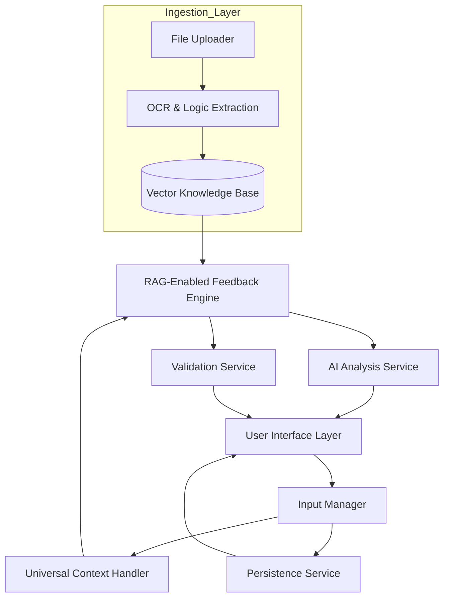

# Design Document: AI Tutor Real-Time Feedback System

## Overview

Trace is an interactive learning platform that provides immediate, continuous guidance as students work through educational content. Moving beyond fixed interaction modes, the system now employs a Universal Multimodal Workspace architecture. This allows users to upload any source material—such as PDFs, high-resolution images, or lecture notes—to serve as the ground-truth knowledge base for real-time, syllabus-specific tutoring.

The platform utilizes a reactive architecture to ensure that user inputs (handwriting, drawing, or typing) trigger analysis pipelines producing feedback within strict latency constraints:

500ms for AI analysis

100ms for UI updates.

## Architecture

### High-Level Architecture



### Component Responsibilities

**User Interface Layer**: Renders the interactive canvas, text editors, and feedback displays. Handles all user interactions and delegates input events to the Input Manager.

**Input Manager**: Routes user input to the appropriate mode handler based on current context. Implements debouncing and throttling to optimize feedback frequency.

**Mode Handlers** (Text, Automata, Use Case): Implement mode-specific logic for interpreting user input, validating content, and formatting feedback requests.

**Feedback Engine**: Coordinates between mode handlers, AI service, and validation service to produce timely, relevant feedback. Manages feedback prioritization and presentation.

**AI Analysis Service**: Provides intelligent analysis of user input including error detection, suggestion generation, and contextual guidance.

**Validation Service**: Implements rule-based validation for formal correctness (diagram syntax, problem-solving steps, etc.).

**Persistence Service**: Handles auto-save, version history, and state restoration.

## Components and Interfaces

### Input Manager

```typescript
interface InputManager {
  registerModeHandler(mode: Mode, handler: ModeHandler): void
  processInput(input: UserInput): void
  setActiveMode(mode: Mode): void
  getCurrentState(): ApplicationState
}

interface UserInput {
  type: InputType  // TEXT | DIAGRAM_ELEMENT | DIAGRAM_CONNECTION
  content: string | DiagramElement
  timestamp: number
  cursorPosition?: Position
}

enum InputType {
  TEXT,
  DIAGRAM_ELEMENT,
  DIAGRAM_CONNECTION,
  SELECTION,
  DELETION
}
```

### Mode Handlers

```typescript
interface ModeHandler {
  handleInput(input: UserInput): FeedbackRequest
  validateState(state: ModeState): ValidationResult[]
  getSuggestions(context: Context): Suggestion[]
}

interface TextModeHandler extends ModeHandler {
  analyzeProblemType(text: string): ProblemType
  trackSolutionProgress(steps: SolutionStep[]): Progress
}

interface AutomataModeHandler extends ModeHandler {
  validateState(state: AutomataState): ValidationResult[]
  checkCompleteness(diagram: AutomataDiagram): CompletenessResult
  findUnreachableStates(diagram: AutomataDiagram): State[]
}

interface UseCaseModeHandler extends ModeHandler {
  validateActor(actor: Actor): ValidationResult[]
  validateUseCase(useCase: UseCase): ValidationResult[]
  validateRelationship(rel: Relationship): ValidationResult[]
  checkUMLConventions(diagram: UseCaseDiagram): ValidationResult[]
}
```

### Feedback Engine

```typescript
interface FeedbackEngine {
  requestFeedback(request: FeedbackRequest): Promise<Feedback>
  prioritizeFeedback(items: FeedbackItem[]): FeedbackItem[]
  presentFeedback(feedback: Feedback): void
  clearFeedback(id: string): void
}

interface FeedbackRequest {
  mode: Mode
  input: UserInput
  currentState: ModeState
  context: Context
}

interface Feedback {
  items: FeedbackItem[]
  timestamp: number
  processingTime: number
}

interface FeedbackItem {
  id: string
  type: FeedbackType  // ERROR | WARNING | SUGGESTION | HINT
  severity: Severity  // CRITICAL | HIGH | MEDIUM | LOW
  location: Location
  message: string
  detailedExplanation?: string
  suggestedFix?: string
}

enum FeedbackType {
  ERROR,
  WARNING,
  SUGGESTION,
  HINT,
  POSITIVE_REINFORCEMENT
}
```

### AI Analysis Service

```typescript
interface AIAnalysisService {
  analyzeText(text: string, context: Context): Promise<AnalysisResult>
  analyzeDiagram(diagram: Diagram, type: DiagramType): Promise<AnalysisResult>
  generateHint(problem: Problem, progress: Progress, level: HintLevel): Promise<Hint>
  suggestImprovements(content: Content): Promise<Suggestion[]>
}

interface AnalysisResult {
  errors: Error[]
  suggestions: Suggestion[]
  confidence: number
  processingTime: number
}

enum HintLevel {
  GENTLE,      // Nudge in right direction
  MODERATE,    // More specific guidance
  DETAILED     // Step-by-step help
}
```

### Validation Service

```typescript
interface ValidationService {
  validateAutomata(diagram: AutomataDiagram): ValidationResult[]
  validateUseCase(diagram: UseCaseDiagram): ValidationResult[]
  validateProblemSolution(solution: Solution, problem: Problem): ValidationResult[]
}

interface ValidationResult {
  isValid: boolean
  errors: ValidationError[]
  warnings: ValidationWarning[]
}

interface ValidationError {
  rule: string
  location: Location
  message: string
  fix?: string
}
```

### Persistence Service

```typescript
interface PersistenceService {
  autoSave(state: ApplicationState): Promise<void>
  loadSession(sessionId: string): Promise<ApplicationState>
  saveVersion(state: ApplicationState): Promise<Version>
  getVersionHistory(sessionId: string): Promise<Version[]>
  clearOldVersions(sessionId: string, keepCount: number): Promise<void>
}

interface Version {
  id: string
  timestamp: number
  state: ApplicationState
  description?: string
}
```

## Data Models

### Core Models

```typescript
interface ApplicationState {
  sessionId: string
  mode: Mode
  textState?: TextState
  diagramState?: DiagramState
  feedbackState: FeedbackState
  lastSaved: number
}

enum Mode {
  TEXT,
  AUTOMATA,
  USE_CASE
}

interface TextState {
  content: string
  cursorPosition: Position
  problemType?: ProblemType
  solutionSteps: SolutionStep[]
}

interface DiagramState {
  type: DiagramType
  elements: DiagramElement[]
  connections: Connection[]
  selectedElements: string[]
}

enum DiagramType {
  AUTOMATA,
  USE_CASE
}

interface DiagramElement {
  id: string
  type: ElementType
  position: Position
  properties: Record<string, any>
}

interface Position {
  x: number
  y: number
}

interface Connection {
  id: string
  source: string
  target: string
  type: ConnectionType
  label?: string
}
```

### Automata-Specific Models

```typescript
interface AutomataDiagram {
  states: State[]
  transitions: Transition[]
  initialState?: string
  acceptingStates: string[]
  alphabet: string[]
}

interface State {
  id: string
  label: string
  position: Position
  isInitial: boolean
  isAccepting: boolean
}

interface Transition {
  id: string
  from: string
  to: string
  symbol: string
}
```

### Use Case-Specific Models

```typescript
interface UseCaseDiagram {
  actors: Actor[]
  useCases: UseCase[]
  relationships: Relationship[]
  systemBoundary?: Boundary
}

interface Actor {
  id: string
  name: string
  position: Position
  type: ActorType  // PRIMARY | SECONDARY | SYSTEM
}

interface UseCase {
  id: string
  name: string
  position: Position
  description?: string
}

interface Relationship {
  id: string
  type: RelationshipType  // ASSOCIATION | INCLUDE | EXTEND | GENERALIZATION
  source: string
  target: string
}

enum RelationshipType {
  ASSOCIATION,
  INCLUDE,
  EXTEND,
  GENERALIZATION
}
```

### Feedback Models

```typescript
interface FeedbackState {
  activeFeedback: Map<string, FeedbackItem>
  feedbackHistory: FeedbackItem[]
  dismissedFeedback: Set<string>
}

interface Context {
  problemType?: ProblemType
  learningObjectives?: string[]
  previousErrors?: Error[]
  sessionDuration: number
}
```


## 

