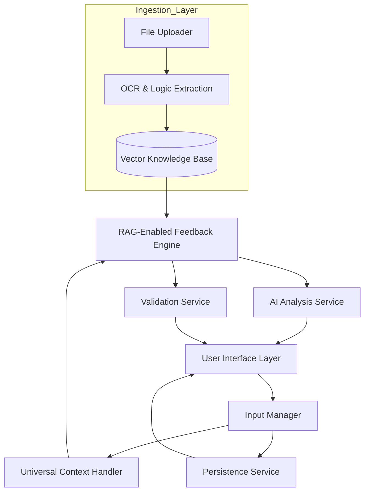

# Design Document: AI Tutor Real-Time Feedback System

## Overview

Trace is an interactive learning platform that provides immediate, continuous guidance as students work through educational content. Moving beyond fixed interaction modes, the system now employs a Universal Multimodal Workspace architecture. This allows users to upload any source material—such as PDFs, high-resolution images, or lecture notes—to serve as the ground-truth knowledge base for real-time, syllabus-specific tutoring.

The platform utilizes a reactive architecture to ensure that user inputs (handwriting, drawing, or typing) trigger analysis pipelines producing feedback within strict latency constraints:

500ms for AI analysis

100ms for UI updates.

## Architecture

### High-Level Architecture



### Component Responsibilities

**User Interface Layer:** Renders the interactive canvas, document viewer, and feedback displays. It handles all user interactions (touch, stylus, keyboard) and delegates input events to the Input Manager.

**Ingestion Layer:** Processes uploaded material (PDF, JPG, PNG) using OCR and logical extraction to populate the Vector Knowledge Base. This layer allows the AI to "read" the student's specific textbook or notes.

**Input Manager:** Routes user input to the dynamic handler. It implements debouncing and throttling to optimize performance and maintain a 100ms UI responsiveness.

**Universal Context Handler:** A context-aware module that adapts validation logic based on the specific material retrieved from the knowledge base, rather than relying on hardcoded rules.

**Feedback Engine:** Coordinates between the Knowledge Base, AI service, and Validation service to produce timely, relevant feedback. It prioritizes feedback by severity to avoid cognitive overload.

**AI Analysis Service (RAG-Enabled):** Provides intelligent analysis of user input grounded in the uploaded documents. It generates error detection, suggestion generation, and progressive "nudge" hints.

**Validation Service:** Implements rule-based validation for formal correctness when the user's material contains structured logic (e.g., mathematical proofs, UML diagrams, or chemical equations).

**Persistence Service:** Handles 30-second auto-saves, version history, and state restoration to ensure no learning progress is lost.

## Components and Interfaces

### Universal Ingestion & Management

```typescript
interface IngestionService {
  uploadMaterial(file: File): Promise<DocumentContext>
  processOCR(file: File): Promise<string>
  generateEmbeddings(content: string): Promise<void>
}

interface InputManager {
  processInput(input: UserInput): void
  setDocumentContext(context: DocumentContext): void
  getCurrentState(): ApplicationState
}

interface UserInput {
  type: InputType  // TEXT | DIAGRAM_ELEMENT | HANDWRITING
  content: string | DiagramElement | StrokeData
  timestamp: number
  cursorPosition?: Position
}
```

### RAG-Enabled Feedback Engine

```typescript
interface FeedbackEngine {
  requestGroundedFeedback(request: FeedbackRequest): Promise<Feedback>
  prioritizeFeedback(items: FeedbackItem[]): FeedbackItem[]
  presentFeedback(feedback: Feedback): void
}

interface FeedbackRequest {
  input: UserInput
  currentState: ApplicationState
  knowledgeContext: KnowledgeContext // Retrieved from Vector KB
}

interface FeedbackItem {
  id: string
  type: FeedbackType  // ERROR | WARNING | SUGGESTION | HINT
  severity: Severity  // CRITICAL | HIGH | MEDIUM | LOW
  location: Location
  message: string
  sourceReference: SourceReference // Page/Section link to uploaded PDF
}

enum HintLevel {
  GENTLE,      // Nudge in right direction
  MODERATE,    // Specific guidance referencing source
  DETAILED     // Step-by-step help from the syllabus
}
```

### Feedback Engine

```typescript
interface FeedbackEngine {
  requestFeedback(request: FeedbackRequest): Promise<Feedback>
  prioritizeFeedback(items: FeedbackItem[]): FeedbackItem[]
  presentFeedback(feedback: Feedback): void
  clearFeedback(id: string): void
}

interface FeedbackRequest {
  mode: Mode
  input: UserInput
  currentState: ModeState
  context: Context
}

interface Feedback {
  items: FeedbackItem[]
  timestamp: number
  processingTime: number
}

interface FeedbackItem {
  id: string
  type: FeedbackType  // ERROR | WARNING | SUGGESTION | HINT
  severity: Severity  // CRITICAL | HIGH | MEDIUM | LOW
  location: Location
  message: string
  detailedExplanation?: string
  suggestedFix?: string
}

enum FeedbackType {
  ERROR,
  WARNING,
  SUGGESTION,
  HINT,
  POSITIVE_REINFORCEMENT
}
```
## Data Models


### Core Learning Models

```typescript
interface ApplicationState {
  sessionId: string
  documentContext: DocumentContext // Metadata for uploaded material
  canvasState: CanvasState         // Current handwriting/drawing data
  feedbackState: FeedbackState
  lastSaved: number
}

interface KnowledgeContext {
  relevantExcerpts: string[]       // Top-k retrieved chunks from Vector KB
  sourceMetadata: SourceMetadata   // Page numbers, document titles
  problemLogic: Record<string, any> // Extracted rules for current task
}

interface SourceReference {
  documentId: string
  pageNumber: number
  textSnippet: string
}
```

### Persistence & Sync

```typescript
interface PersistenceService {
  autoSave(state: ApplicationState): Promise<void>
  loadSession(sessionId: string): Promise<ApplicationState>
  saveVersion(state: ApplicationState): Promise<Version>
  getVersionHistory(sessionId: string): Promise<Version[]>
}
```


## 


